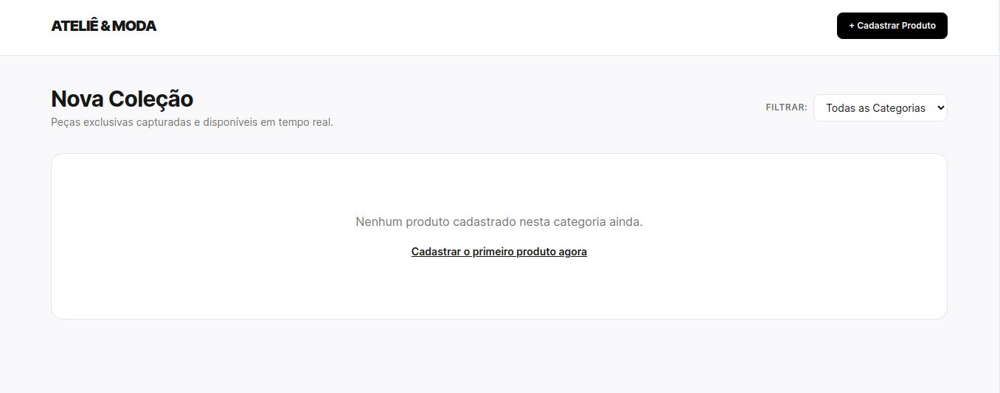

# ✨ Ateliê & Moda — E-commerce & Painel Administrativo

> Um aplicativo web de e-commerce de moda moderno, responsivo e integrado a um painel administrativo completo, desenvolvido com foco em performance, experiência mobile-first e fluxo rápido de cadastro de produtos com câmera ao vivo.

🌐 **Acesse o site em produção:** [https://ecommerce-moda.onrender.com](https://ecommerce-moda.onrender.com)

---

## 📸 Preview da Aplicação

Abaixo está uma prévia da vitrine principal da aplicação, estruturada com design limpo, minimalista e responsivo utilizando Tailwind CSS:



---

## 🚀 Tecnologias Utilizadas

O projeto foi construído utilizando uma stack leve, moderna e eficiente:

* **Backend:** Node.js com Express.js
* **Banco de Dados:** SQLite (com persistência local em arquivo)
* **Motor de Visualização (Template Engine):** EJS (Embedded JavaScript)
* **Upload e Mídia:** Multer (para arquivos) e suporte a Base64 para captura via webcam
* **Estilização:** Tailwind CSS (via CDN)
* **Deploy e Hospedagem:** Render (Web Service em nuvem)

---

## 🛠️ Principais Funcionalidades

* **Vitrine Dinâmica com Filtros:** Listagem de peças de moda com filtragem instantânea por categorias (Moda Feminina, Masculina, Calçados, Tecidos, etc.).
* **Painel Administrativo (`/admin/novo`):** Tela restrita para o cadastro ágil de novos itens contendo nome, categoria, preço e imagem.
* **Integração Nativa com Câmera / Webcam:** 
  * Nos dispositivos móveis, aciona diretamente a câmera nativa do celular.
  * Em desktops, conta com um módulo de preview ao vivo via navegador (captura em tempo real por stream de vídeo convertida para Base64).
* **Gestão de Produtos (CRUD):** Capacidade completa de adicionar e excluir produtos (removendo automaticamente os arquivos de imagem associados do servidor).
* **Experiência de Carregamento Otimizada:** Tela de splash/loading integrada para mitigar a latência de *cold-start* típica de instâncias gratuitas em nuvem.

---

## ⚙️ Como Executar o Projeto Localmente

Se você deseja clonar e rodar este repositório na sua máquina:

1. Clone o repositório:
   ```bash
   git clone [https://github.com/AnteroVieira/ecommerce-moda.git](https://github.com/AnteroVieira/ecommerce-moda.git)
